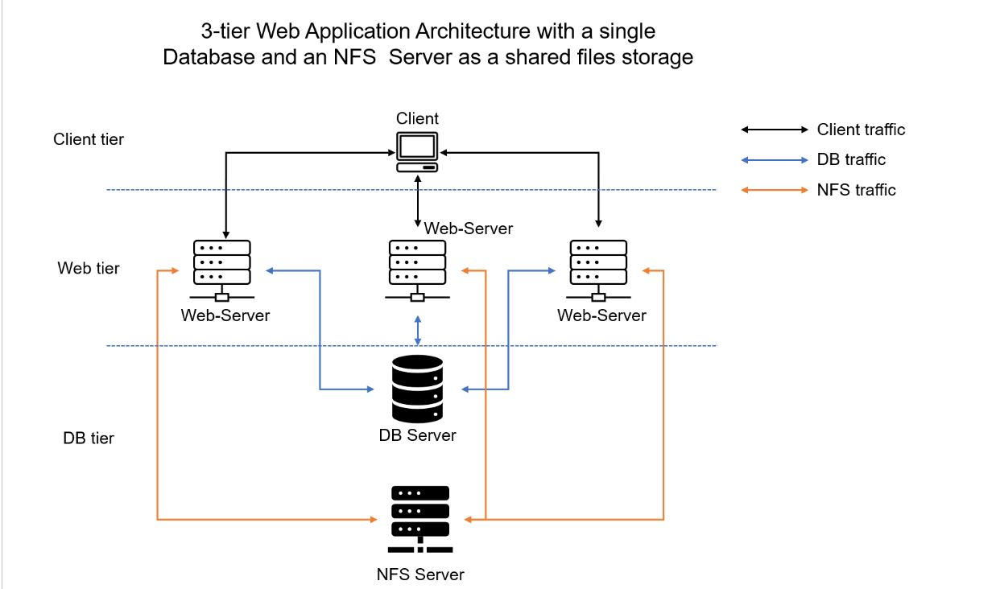
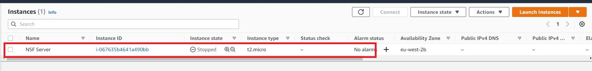

## DEVOPS TOOLING WEBSITE SOLUTION

In this project I will be implementing a solution which consist of following components:

1. Infrastructure AWS
2. Webserver Linux: Red Hat Enterprise Linux 8
3. Database Server : Ubuntu 20.4 + MySQL
4. Storage Server : Red Hat Enterprise Linux 8 + NFS Server
5. Programming Language : PHP
6. Code Repository : GitHUB

I will be using MobaXterm tool to SSH into EC2 Instance

On the diagram below you can see a common pattern where several stateless Web Servers share a common database and also access the same files using Network File System (NFS) as a shared file storage. Even though the NFS server might be located on a completely separate hardware – for Web Servers it look like a local file system from where they can serve the same files.

First I'm going to Launch EC2 instance with RHEL Linux 8 Operating System

Next create the volumes which will be attached to the EC2 instance (NSF Server)

Next I will be partition the volumes using <code>lsblk </code> command for all  3 volumes

Next is to install LVM2 by executing this command <code>sudo yum install lvm2</code>

Next is to create mount points on /mnt directory for the logical volumes as follow:

Mount lv-apps on /mnt/apps – To be used by webservers

Mount lv-logs on /mnt/logs – To be used by webserver logs

Mount lv-opt on /mnt/opt – To be used by Jenkins server in Project 8

