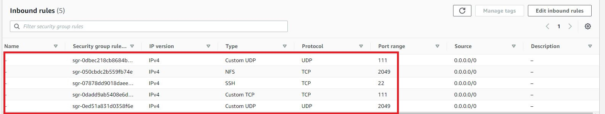

## DEVOPS TOOLING WEBSITE SOLUTION

In this project I will be implementing a solution which consist of following components:

1. Infrastructure AWS
2. Webserver Linux: Red Hat Enterprise Linux 8
3. Database Server : Ubuntu 20.4 + MySQL
4. Storage Server : Red Hat Enterprise Linux 8 + NFS Server
5. Programming Language : PHP
6. Code Repository : GitHUB

I will be using MobaXterm tool to SSH into EC2 Instance

On the diagram below you can see a common pattern where several stateless Web Servers share a common database and also access the same files using Network File System (NFS) as a shared file storage. Even though the NFS server might be located on a completely separate hardware – for Web Servers it look like a local file system from where they can serve the same files.

First I'm going to Launch EC2 instance with RHEL Linux 8 Operating System

Next create the volumes which will be attached to the EC2 instance (NSF Server)

Next I will be partition the volumes using <code>lsblk </code> command for all  3 volumes

Next is to install LVM2 by executing this command <code>sudo yum install lvm2</code>

Next is to create mount points on /mnt directory for the logical volumes as follow:

Mount lv-apps on /mnt/apps – To be used by webservers

Mount lv-logs on /mnt/logs – To be used by webserver logs

Mount lv-opt on /mnt/opt – To be used by Jenkins server in next Project< Project 8>

First create the mount points

Next step is to /mnt directory for the logical volumes

I will need to create a physical volumes by running <code>sudo pvcreate /dev/xvdb1 /dev/xvdc1></code>

Next step is to format the logical volumes

Next step is to Mount the logical volumes and update block ID. 

Edit etc fstab via Vim

Now run command to confirm configuration was successful with no errors using <code>sudo mount -a></code>

If it returns with no error message then it was successful , run <code>df -h</code>

Next is to install NSF Server, configure it to start on reboot and confirm it runs.

First update on the NSF Server by running <code>sudo yum update</code>

Next is to install NSF Server by running the command <code>sudo yum install nfs-utils -y</code>

Then to enable and start nsf server service run the following commands:

<code>sudo systemctl start nfs-server.service</code>

<code>sudo systemctl enable nfs-server.service</code>

<code>sudo systemctl status nfs-server.service</code>

Next stage is to export the mounts for webservers subnet cidr to connect as a clients, to check subnet - cidr open EC2 instance details in AWS Web console and locate 'Networking' tab and open the Subnet like below.

Next step is to ensure I can setup permission that allows web server to read,write and execute on NFS by running the commands

<code>
sudo chown -R nobody: /mnt/apps

sudo chown -R nobody: /mnt/logs

sudo chown -R nobody: /mnt/opt

sudo chmod -R 777 /mnt/apps

sudo chmod -R 777 /mnt/logs

sudo chmod -R 777 /mnt/opt
</code>

Then restart the server service

<code>sudo systemctl restart nfs-server.service</code>

Configure access to NFS for clients within the same subnet CIDR – 172.31.32.0/20 by running the command 

<code>sudo vi /etc/export</code>

Save it by running <code>Esc + :wq!</code>

Next run <code>sudo exportfs -arv</code>

Check which port is used by NFS and open it using Security Groups (add new Inbound Rule) using 

<code>rpcinfo -p | grep nfs</code>

In order for NFS server to be accessible from your client, you must also open following ports: TCP 111, UDP 111, UDP 2049

